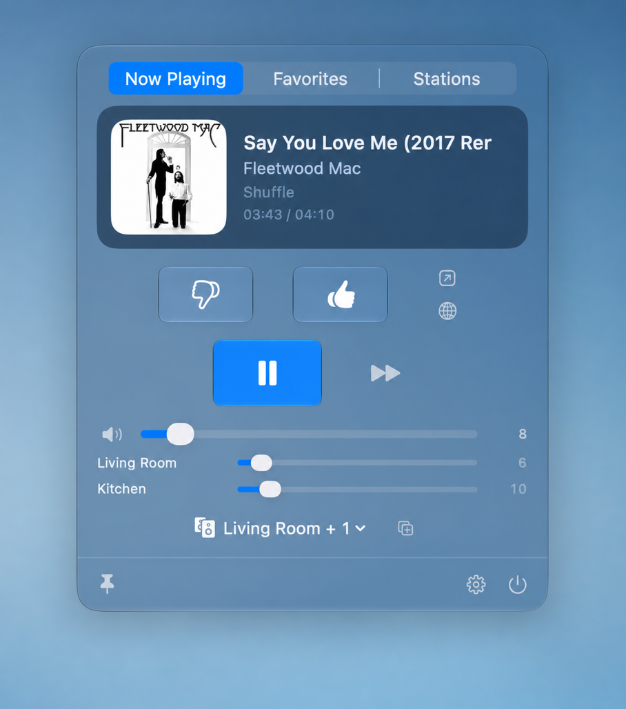
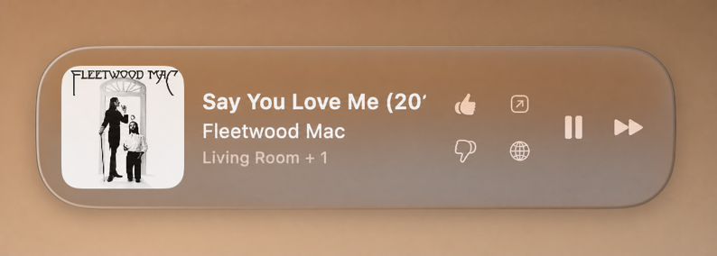

# SonoGlass

**A native macOS + visionOS controller for Sonos — the one with Pandora thumbs.**


Controls Sonos speakers over the **local network only** (UPnP/SOAP — no Sonos
account, no Sonos cloud API), with the feature no shipping third-party Mac
controller has: **working Pandora thumbs up / down**. Plus a floating glass
mini player, whole-house grouping with per-room volume, Sonos
Favorites/Playlists/Stations browsing, one-tap **Apple Music Favorites**, and a
**Vision Pro** app.

Favorites live on the speakers; Pandora stations use your Pandora credentials
(stored only in the Keychain). No Sonos login exists anywhere in this app.

> **Why it exists:** the official Sonos desktop app was abandoned, and no Mac
> controller relays Pandora thumbs to your account. This one does — by asking
> the *player* to rate through its own service session (see
> [`CHANGELOG.md`](CHANGELOG.md) for the full protocol reverse-engineering
> story, dead ends included).

<p align="center">
  
</p>
<p align="center">
  
</p>

## Features

- 🎛 **Full transport & control** — play/pause/skip, volume, mute, from the menu bar
- 👍 **Pandora thumbs** — up/down land in your real Pandora account (down auto-skips)
- ⭐️ **Apple Music Favorites** — one tap, straight to your library (MusicKit)
- 🔎 **Find-in-Apple-Music** — the Shazam step, minus the microphone
- 🔊 **Whole-house grouping** — join/split rooms, independent per-room volume
- 📻 **Browse & play** — Sonos Favorites, Playlists, and your Pandora stations
- 🪟 **Floating glass mini player** — always-on-top, over full-screen apps
- 🥽 **Vision Pro** — the same app as a spatial glass window

## Status

***REMOVED BY PRIVACY REWRITE***
Not affiliated with Sonos, Pandora, or Apple. Uses documented-but-unofficial
local protocols; a firmware or API change could break pieces of it (the
`pandora-probe` / `sonoglass-diag` CLIs exist to diagnose exactly that).

## Building

No Xcode required — Command Line Tools are enough.

```sh
scripts/make_app.sh            # release build → dist/SonoGlass.app (sandboxed, ad-hoc signed)
open dist/SonoGlass.app
```

Variants:

```sh
SANDBOX=0 scripts/make_app.sh  # build without App Sandbox (try this if discovery fails)
CONFIG=debug scripts/make_app.sh
scripts/run_tests.sh           # unit tests (22 tests)
swift run sonoglass-diag [ip]  # CLI protocol smoke test against your real speakers
```

**Toolchain note:** the build pins the **macOS 26.5 SDK**
(`/Library/Developer/CommandLineTools/SDKs/MacOSX26.5.sdk`). The macOS 27 beta SDK
turns SwiftUI property wrappers into compiler macros whose plugins only ship inside
full Xcode, so plain CLT builds fail against it. If you install Xcode 27 later you can
drop the pin. `scripts/run_tests.sh` uses SwiftPM's native build system and passes
explicit framework/plugin/rpath flags for CLT's out-of-the-way `Testing.framework`.

## First launch

1. The menu bar shows a speaker icon (no Dock icon — it's an `LSUIElement` app).
2. macOS asks for **Local Network** permission on first discovery. If you declined it:
   System Settings → Privacy & Security → Local Network → enable SonoGlass, then
   hit **Retry** in the popover.
3. If multicast discovery still finds nothing (unusual networks, VLANs), enter one
   speaker's IP under Settings → Advanced — one reachable player bootstraps the whole
   household, because topology is read from the player itself.

## Pandora

- Settings → Pandora: e-mail + password, **Verify & Save** does a live login and
  reports Pandora's actual error message on failure.
- Credentials are stored in the **login Keychain** (`SonoGlass.Pandora`), never in
  UserDefaults. "Remove account" deletes them.
### Thumbs (how they actually reach Pandora)

Modern Sonos firmware plays Pandora through the cloud-queue ("programmed
radio") integration. The track URI carries only catalog ids
(`VC1::ST::ST:{station}::TR:{track}::…`), and after live testing every
credential-based path is a dead end for *new* thumbs:

- Pandora's **v5 tuner API** and **listener GraphQL API** both require a real
  session `trackToken` (the GraphQL error is literally "Current index or
  trackToken must be provided") — the URIs don't have one. GraphQL can only
  *update* feedback that already exists.
- Pandora's **SMAPI `rateItem`** endpoint answers success but is a stub — the
  rating never persists (verified: `getExtendedMetadata` rating stays 0).
- Per Sonos's programmed-radio spec, ratings are POSTed **by the player** to
  the service's radio API using the player's own session.

So SonoGlass does what the official app does: it asks the **player** to rate,
over the local Sonos websocket (`wss://{ip}:1443/websocket/api`, namespace
`playbackMetadata:1`, command `rate` with the current queue `itemId`). The
player submits the rating through its own Pandora session and returns the new
state (`THUMBSUP/POSITIVE`). **No Pandora credentials or linking needed for
thumbs at all.** Verified end-to-end: the rating flips server-side and shows
on the pandora.com Thumbs Up profile page.

Notes:
- 👎 relies on Pandora's auto-skip; if the track doesn't change within ~1.5 s
  the app sends `Next` itself.
- Already-rated tracks show a filled thumb from the track metadata
  (`<r:rating>` in DIDL / `rating` in the websocket metadata).
- Thumbs on **Shuffle** are credited to the origin station of the song —
  that's Pandora behavior, visible on your profile's Thumbs Up page.
- The Pandora **Stations** tab still uses your Pandora username/password
  (v5 API). `SonosKit/PandoraSMAPI.swift` (AppLink device-link + rateItem) is
  kept for reference and the `pandora-probe` diagnostic CLI.
  - Previous is hidden for Pandora radio (can't rewind); Next stays (it's a skip).
- The **Stations** tab lists your full station list (`user.getStationList`) in
  Pandora's order (QuickMix/Thumbprint first). Selecting one plays it on the current
  group — via the matching Sonos Favorite's stored metadata when one exists, otherwise
  via a constructed `x-sonosapi-radio:` URI + DIDL.

### Debug trick

**Option-click the album art** (popover or mini player) to copy the raw station +
track URIs to the clipboard. If thumbs ever stop parsing on a future firmware, this
shows the exact URI shape in seconds. Settings → Advanced → "Copy diagnostics" grabs
the full picture (groups, transport, URIs, event health).

## How playback of saved content works

- **Favorites (`FV:2`)** and **Playlists (`SQ:`)** are read from any player over
  ContentDirectory `Browse` — this is the same mechanism "guest mode" controllers use.
- Every favorite carries `r:resMD`, the exact DIDL metadata Sonos stored for it; it is
  passed through verbatim (never hand-built).
- Stream-type favorites (`x-sonosapi-stream/radio/hls`, `x-rincon-mp3radio`,
  `hls-radio`, `aac`) → `SetAVTransportURI` + `Play` on the group coordinator.
- Container-type favorites (`x-rincon-cpcontainer`, `file:` saved queues) → replace
  queue (`RemoveAllTracksFromQueue` → `AddURIToQueue` → point transport at
  `x-rincon-queue:{coordinator}#0` → `Seek` → `Play`).
- Unknown schemes try the stream path first, then fall back to the container path.

## Live updates

UPnP GENA subscriptions (AVTransport + rendering control + topology) deliver push
events to a local HTTP listener; subscriptions renew at half their granted timeout.
A polling safety net runs regardless — every 5 s normally, dropping to 1 s
automatically if eventing is unhealthy (Settings → Advanced shows which mode is
active). The UI never silently goes stale.

## Repo layout

```
Sources/App/        @main, AppState, SwiftUI popover/mini player/settings (UI/ subfolder)
Sources/SonosKit/   SSDP+Bonjour discovery, SOAP client, DIDL/topology parsers,
                    GENA eventing, SonosSystem actor
Sources/PandoraKit/ Pandora JSON API v5 client, Blowfish crypto, token parser, Keychain
Sources/DiagCLI/    sonoglass-diag — protocol smoke test CLI
Tests/              unit tests (token parsing, crypto, DIDL, topology, classifier)
Resources/          Info.plist, entitlements
scripts/            make_app.sh, run_tests.sh
```

## Apple Music Favorites

When an Apple Music track plays (`x-sonos-http:song%3a{id}.mp4?sid=204`), a ☆ star
appears in the popover and mini player. It toggles the song's **Favorite** state via
MusicKit (`PUT/DELETE /v1/me/ratings/songs/{id}`), prefilled from the current rating.
Requires the **team-signed build**: `TEAM=<teamid> scripts/make_app_signed.sh`
(XcodeGen + xcodebuild with automatic signing; the App ID `com.sonoglass.app` must
have the MusicKit App Service enabled in the developer portal, and the entitlements
force an embedded provisioning profile — MusicKit refuses ad-hoc builds).
First use shows Apple's one-time Media & Apple Music permission dialog.

## Phase 2 — not built yet (deliberately)

1. Media-key / global keyboard shortcuts.
2. Grouping editor, sleep timer, current-queue view (`Q:0`), widgets,
   Shortcuts/AppleScript.
3. Deep service catalog browse/search (SMAPI device-link auth — fragile; favorites +
   stations cover daily use).
4. Sonos cloud OAuth for out-of-home control.
5. Multiple Pandora accounts / households.
