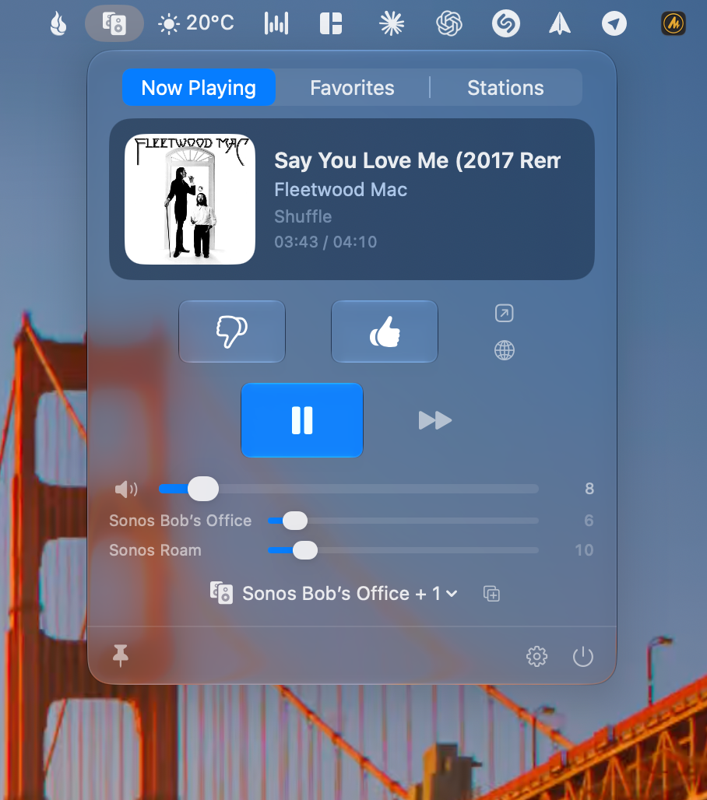
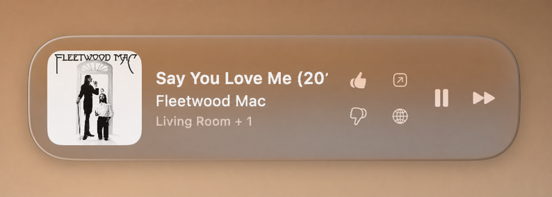

# SonoGlass

**A native macOS + visionOS controller for Sonos — the one with Pandora thumbs.**


Controls Sonos speakers over the **local network** (UPnP/SOAP — no Sonos
account or Sonos cloud API), including **Pandora thumbs up / down**. Plus a floating glass
mini player, whole-house grouping with per-room volume, Sonos
Favorites/Playlists/Stations browsing, one-tap **Apple Music Favorites**, and a
**Vision Pro** app.

Favorites live on the speakers. Pandora station browsing uses your Pandora
credentials and contacts Pandora over HTTPS; Apple Music features contact Apple.
Credentials and sessions are stored in Keychain and may sync through iCloud
Keychain. No Sonos login is required.

> Built for a native menu-bar player with Pandora rating controls. See
> [`CHANGELOG.md`](CHANGELOG.md) for the protocol investigation and development history.

<p align="center">
  
</p>
<p align="center">
  
</p>

## Features

- 🎛 **Full transport & control** — play/pause/skip, volume, mute, from the menu bar
- 👍 **Pandora thumbs** — up/down land in your real Pandora account (down auto-skips)
- ⭐️ **Apple Music Favorites** — one tap, straight to your library (MusicKit)
- 🔎 **Find-in-Apple-Music** — the Shazam step, minus the microphone
- 🔊 **Whole-house grouping** — join/split rooms, independent per-room volume
- 📻 **Browse & play** — Sonos Favorites, Playlists, and your Pandora stations
- 🪟 **Floating glass mini player** — always-on-top, over full-screen apps
- 🥽 **Vision Pro** — the same app as a spatial glass window

## Status

Personal project, built and used daily against a multi-speaker household.
Not affiliated with Sonos, Pandora, or Apple. Uses documented-but-unofficial
local protocols; a firmware or API change could break pieces of it (the
`pandora-probe` / `sonoglass-diag` CLIs exist to diagnose exactly that).

## Install on another Mac

Requires **macOS 26 or later**, a supported Apple Silicon or Intel Mac, and
**Xcode 26+ or Command Line Tools 26+**. Install the tools first (for CLT, run
`xcode-select --install`). A developer account is **not** needed for Sonos
playback, grouping, Pandora thumbs, or Pandora station browsing.

```sh
git clone https://github.com/plantbob0101/SonoGlass.git
cd SonoGlass
scripts/run_tests.sh
scripts/make_app.sh
scripts/install_app.sh
```

Open `SonoGlass.app` from the location printed by the installer. On a new Mac
this is `~/Applications`; the installer reuses an existing installation in
`~/Applications` or `/Applications` when there is one. To choose explicitly:

```sh
scripts/install_app.sh /Applications
open /Applications/SonoGlass.app
```

Quit the running app before updating. The installer verifies the signature,
refuses to overwrite unrelated files, and saves the previous app in a ZIP.
Install one copy per Mac and launch that installed copy; `dist/` is build output.
Local builds are signed on the Mac where they are built. They are not notarized
prebuilt downloads, so build again on each Mac instead of copying a development
signature or someone else's signing credentials.

**First launch:**

1. Open the speaker icon in the menu bar. SonoGlass has no Dock icon.
2. Allow **Local Network** access. If discovery is blocked, enable SonoGlass in
   System Settings → Privacy & Security → Local Network, then click **Retry**.
3. Keep the Mac and speakers on a network that permits communication between
   devices. If multicast discovery fails, enter a speaker's **private IPv4
   address** in Settings → Advanced. One reachable speaker supplies the topology.
4. Use the pin button to show the mini player. Drag its top-center handle; it
   appears on hover and fades when idle. Settings controls whether it opens at launch.
5. Check room selection, playback, volume, and mini-player dragging on that Mac.
   Each Mac has its own network permissions and window positions.

The default build uses the hardened runtime **without App Sandbox**, matching
this app's direct local-network control and callback listener. Sandbox is opt-in:
`SANDBOX=1 scripts/make_app.sh`. Apple Music Favorites requires the separate
team-signed setup below; the ordinary local build supports core Sonos controls.

## Updating an existing clone

```sh
cd /path/to/SonoGlass
git switch main
git pull --ff-only
scripts/run_tests.sh
scripts/make_app.sh
# Quit SonoGlass, then:
scripts/install_app.sh
```

If Git reports local changes, preserve them before updating. These commands do
not reset your checkout, erase settings, or migrate another Mac's credentials.

## Build options and checks

```sh
CONFIG=debug scripts/make_app.sh
SANDBOX=1 scripts/make_app.sh
BUILD_DIR=/tmp/sonoglass-build DIST_DIR=/tmp/sonoglass-dist scripts/make_app.sh
scripts/run_tests.sh
swift run sonoglass-diag [private-speaker-ip]
```

Scripts use the selected Xcode/CLT and discover its SDK. `DEVELOPER_DIR` and `SDK`
can be set for one command; the scripts never change the system selection. If a
beta CLT lacks the SwiftUI compiler plugins, use a matching stable Xcode/CLT
installation. Dependencies are recorded in `Package.resolved`.

GitHub Actions builds and tests the app on Apple Silicon and Intel, checks the
local and sandbox variants, and exercises installation/update in a temporary
folder. Hardware checks are separate: see [the audit and acceptance record](docs/AUDIT.md).

## Pandora

- Settings → Pandora: e-mail + password, **Verify & Save** does a live login and
  reports Pandora's error on failure. A failed verification leaves the saved
  account intact.
- Credentials are stored in the **login Keychain** (`SonoGlass.Pandora`), never in
  UserDefaults. "Remove account" deletes them.
### Thumbs (how they actually reach Pandora)

Modern Sonos firmware plays Pandora through the cloud-queue ("programmed
radio") integration. The track URI carries only catalog ids
(`VC1::ST::ST:{station}::TR:{track}::…`), and after live testing every
credential-based path is a dead end for *new* thumbs:

- Pandora's **v5 tuner API** and **listener GraphQL API** both require a real
  session `trackToken` (the GraphQL error is literally "Current index or
  trackToken must be provided") — the URIs don't have one. GraphQL can only
  *update* feedback that already exists.
- Pandora's **SMAPI `rateItem`** endpoint answers success but is a stub — the
  rating never persists (verified: `getExtendedMetadata` rating stays 0).
- Per Sonos's programmed-radio spec, ratings are POSTed **by the player** to
  the service's radio API using the player's own session.

So SonoGlass does what the official app does: it asks the **player** to rate,
over the local Sonos websocket (`wss://{ip}:1443/websocket/api`, namespace
`playbackMetadata:1`, command `rate` with the current queue `itemId`). The
player submits the rating through its own Pandora session and returns the new
state (`THUMBSUP/POSITIVE`). **No Pandora credentials or linking needed for
thumbs at all.** Verified end-to-end: the rating flips server-side and shows
on the pandora.com Thumbs Up profile page.

Notes:
- 👎 relies on Pandora's auto-skip; if the track doesn't change within ~1.5 s
  the app sends `Next` itself.
- Already-rated tracks show a filled thumb from the track metadata
  (`<r:rating>` in DIDL / `rating` in the websocket metadata).
- Thumbs on **Shuffle** are credited to the origin station of the song —
  that's Pandora behavior, visible on your profile's Thumbs Up page.
- The Pandora **Stations** tab still uses your Pandora username/password
  (v5 API). `SonosKit/PandoraSMAPI.swift` (AppLink device-link + rateItem) is
  kept for reference and the `pandora-probe` diagnostic CLI.
  - Previous is hidden for Pandora radio (can't rewind); Next stays (it's a skip).
- The **Stations** tab lists your full station list (`user.getStationList`) in
  Pandora's order (QuickMix/Thumbprint first). Selecting one plays it on the current
  group — via the matching Sonos Favorite's stored metadata when one exists, otherwise
  via a constructed `x-sonosapi-radio:` URI + DIDL.

### Debug trick

**Option-click the album art** (popover or mini player) to copy the raw station +
track URIs to the clipboard. If thumbs ever stop parsing on a future firmware, this
shows the exact URI shape in seconds. Settings → Advanced → "Copy diagnostics" grabs
the full picture (groups, transport, URIs, event health).

## How playback of saved content works

- **Favorites (`FV:2`)** and **Playlists (`SQ:`)** are read from any player over
  ContentDirectory `Browse` — this is the same mechanism "guest mode" controllers use.
- Every favorite carries `r:resMD`, the exact DIDL metadata Sonos stored for it; it is
  passed through verbatim (never hand-built).
- Stream-type favorites (`x-sonosapi-stream/radio/hls`, `x-rincon-mp3radio`,
  `hls-radio`, `aac`) → `SetAVTransportURI` + `Play` on the group coordinator.
- Container-type favorites (`x-rincon-cpcontainer`, `file:` saved queues) → replace
  queue (`RemoveAllTracksFromQueue` → `AddURIToQueue` → point transport at
  `x-rincon-queue:{coordinator}#0` → `Seek` → `Play`).
- Unknown schemes try the stream path first, then fall back to the container path.

## Live updates

UPnP GENA subscriptions (AVTransport + rendering control + topology) deliver push
events to a local HTTP listener; subscriptions renew at half their granted timeout.
A polling safety net runs regardless — every 5 s normally, dropping to 1 s
automatically if eventing is unhealthy (Settings → Advanced shows which mode is
active). The UI never silently goes stale.

## Repo layout

```
Sources/App/        @main, AppState, SwiftUI popover/mini player/settings (UI/ subfolder)
Sources/SonosKit/   SSDP+Bonjour discovery, SOAP client, DIDL/topology parsers,
                    GENA eventing, SonosSystem actor
Sources/PandoraKit/ Pandora JSON API v5 client, Blowfish crypto, token parser, Keychain
Sources/DiagCLI/    sonoglass-diag — protocol smoke test CLI
Tests/              unit tests (token parsing, crypto, DIDL, topology, classifier)
Resources/          Info.plist, entitlements
scripts/            build, test, toolchain selection, and safe local installation
```

## Contributors

- [`plantbob0101`](https://github.com/plantbob0101) — creator and maintainer
- Claude Fable 5 — AI development collaborator
- OpenAI Codex — AI security and development collaborator

## Apple Music Favorites

When an Apple Music track plays (`x-sonos-http:song%3a{id}.mp4?sid=204`), a ☆ star
appears in the popover and mini player. It toggles the song's **Favorite** state via
MusicKit (`PUT/DELETE /v1/me/ratings/songs/{id}`), prefilled from the current rating.
Requires the **team-signed build**: `TEAM=<teamid> scripts/make_app_signed.sh`
(XcodeGen + xcodebuild with automatic signing; the App ID `com.sonoglass.app` must
have the MusicKit App Service enabled in the developer portal, and the entitlements
force an embedded provisioning profile — MusicKit refuses ad-hoc builds).
First use shows Apple's one-time Media & Apple Music permission dialog.

## Phase 2 — not built yet (deliberately)

1. Media-key / global keyboard shortcuts.
2. Grouping editor, sleep timer, current-queue view (`Q:0`), widgets,
   Shortcuts/AppleScript.
3. Deep service catalog browse/search (SMAPI device-link auth — fragile; favorites +
   stations cover daily use).
4. Sonos cloud OAuth for out-of-home control.
5. Multiple Pandora accounts / households.
